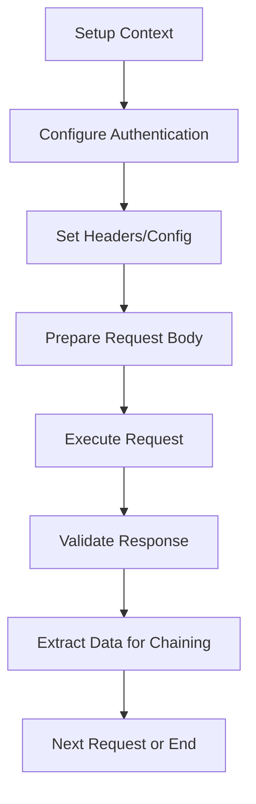

# CS Test Automation Framework - API Testing Documentation

## Table of Contents
1. [Overview](#overview)
2. [Framework Architecture](#framework-architecture)
3. [Core Components](#core-components)
4. [API Testing Workflow](#api-testing-workflow)
5. [BDD Step Definitions](#bdd-step-definitions)
6. [Configuration and Setup](#configuration-and-setup)
7. [Examples and Usage Patterns](#examples-and-usage-patterns)
8. [Best Practices](#best-practices)

## Overview

The CS Test Automation Framework provides a comprehensive API testing solution built with TypeScript, designed for both parallel and sequential execution modes. It offers extensive BDD (Behavior-Driven Development) step definitions, context management, authentication handling, and advanced validation capabilities.

### Key Features
- **133 BDD Step Definitions** for complete API testing coverage
- **11 Authentication Types** including OAuth2, JWT, AWS Signature V4, NTLM
- **Advanced Request Chaining** with response data extraction
- **Comprehensive Validation** including JSON Schema, JSONPath, XPath, Regex
- **Template Engine** with 50+ built-in functions
- **Connection Pooling** and retry mechanisms
- **Parallel/Sequential Execution** support
- **Context Management** for state persistence

## Framework Architecture

```
src/api/
├── types/              # Type definitions and interfaces
├── client/             # HTTP client and connection management
├── context/            # API context and state management
├── templates/          # Request templating and placeholders
├── validators/         # Response validation components
├── auth/              # Authentication handlers
└── CSAPIClient.ts     # Main API client facade

src/steps/api/         # BDD Step Definitions
├── CSAPIGenericSteps.ts           # Basic API operations
├── CSAPIRequestSteps.ts           # Request execution
├── CSAPIAuthenticationSteps.ts    # Authentication setup
├── CSAPIValidationSteps.ts        # Response validation
├── CSAPIChainingSteps.ts          # Request chaining
├── CSAPIRequestBodySteps.ts       # Body manipulation
├── CSAPIRequestConfigSteps.ts     # Request configuration
├── CSAPIRequestHeaderSteps.ts     # Header management
├── CSAPIRequestExecutionSteps.ts  # Advanced execution
├── CSAPIResponseValidationSteps.ts # Comprehensive validation
└── CSAPIUtilitySteps.ts           # Utility operations
```

## Core Components

### 1. CSAPIClient.ts - Main API Client

The central facade for all API operations, providing high-level methods for HTTP requests, authentication, and context management.

**Key Methods:**
```typescript
// HTTP Methods
await apiClient.get(url, options)
await apiClient.post(url, body, options)
await apiClient.put(url, body, options)
await apiClient.patch(url, body, options)
await apiClient.delete(url, options)

// Context Management
apiClient.createContext(name, baseUrl)
apiClient.switchContext(name)
apiClient.setBaseUrl(url)

// Authentication
apiClient.setAuth(authConfig)
apiClient.setDefaultHeader(name, value)

// File Operations
await apiClient.uploadFile(url, filePath, fieldName)
await apiClient.downloadFile(url, destinationPath)
```

**Example Usage:**
```typescript
const apiClient = new CSAPIClient();
apiClient.setBaseUrl('https://api.example.com');
apiClient.setDefaultHeader('Content-Type', 'application/json');

const response = await apiClient.post('/users', {
    name: 'John Doe',
    email: 'john@example.com'
});
```

### 2. CSApiContext.ts - Context Management

Manages API test state, including variables, responses, headers, and authentication across test scenarios.

**Key Features:**
- Variable storage and retrieval
- Response caching with aliases
- Cookie and header management
- Request history tracking
- Context switching for different environments

**Example Usage:**
```typescript
const context = apiClient.createContext('test-env', 'https://api.test.com');
context.setVariable('userId', '12345');
context.setHeader('Authorization', 'Bearer token123');

// Variables are available across all requests in this context
const userId = context.getVariable('userId');
```

### 3. CSHttpClient.ts - HTTP Client

Low-level HTTP client with advanced features like connection pooling, proxy support, and retry mechanisms.

**Key Features:**
- Connection pooling for performance
- Automatic cookie handling
- Proxy configuration
- Request/response interceptors
- File upload/download with progress tracking

### 4. Authentication Handlers

Comprehensive authentication support with 11 different authentication types:

#### CSBasicAuthHandler.ts
```typescript
const authConfig = {
    type: 'basic',
    username: 'user123',
    password: 'pass456'
};
```

#### CSOAuth2Handler.ts
```typescript
const authConfig = {
    type: 'oauth2',
    clientId: 'your-client-id',
    clientSecret: 'your-client-secret',
    tokenUrl: 'https://oauth.example.com/token',
    scope: 'read write'
};
```

#### CSJWTHandler.ts
```typescript
const authConfig = {
    type: 'jwt',
    token: 'eyJhbGciOiJIUzI1NiIsInR5cCI6IkpXVCJ9...',
    headerName: 'Authorization',
    prefix: 'Bearer'
};
```

### 5. Validators

#### CSJSONPathValidator.ts
Validates JSON responses using JSONPath expressions.

```typescript
const config = {
    path: '$.users[0].id',
    value: '12345',
    exists: true,
    type: 'string'
};
```

#### CSSchemaValidator.ts
Validates responses against JSON Schema.

```typescript
const config = {
    schema: {
        type: 'object',
        properties: {
            id: { type: 'string' },
            name: { type: 'string' }
        },
        required: ['id', 'name']
    }
};
```

## API Testing Workflow

### 1. Basic Test Flow



### 2. Context-Driven Testing

1. **Context Creation**: Each test environment gets its own context
2. **Variable Management**: Store and reuse data across requests
3. **Response Chaining**: Extract data from one response for the next request
4. **State Persistence**: Maintain cookies, headers, and auth tokens

## BDD Step Definitions

### 1. CSAPIGenericSteps.ts - Basic Operations

**Purpose**: Fundamental API testing operations like context setup and basic requests.

**Key Step Definitions:**
```gherkin
Given user is working with API context "test-environment"
Given user sets base URL to "https://api.example.com"
When user sends GET request to "/users"
Then response status should be 200
```

**Example Scenario:**
```gherkin
Feature: User Management API
  Scenario: Get user list
    Given user is working with API context "user-api"
    And user sets base URL to "https://jsonplaceholder.typicode.com"
    When user sends GET request to "/users"
    Then response status should be 200
    And response should contain users data
```

### 2. CSAPIAuthenticationSteps.ts - Authentication Setup

**Purpose**: Configure various authentication methods for API requests.

**Key Step Definitions:**
```gherkin
Given user sets basic authentication with username "admin" and password "secret"
Given user sets bearer token "eyJhbGciOiJIUzI1NiIsInR5cCI6IkpXVCJ9..."
Given user sets API key "abc123" in header "X-API-Key"
Given user configures OAuth2 with client ID "client123" and secret "secret456"
```

**Example Scenario:**
```gherkin
Feature: Authenticated API Access
  Scenario: Access protected resource with JWT
    Given user is working with API context "secure-api"
    And user sets base URL to "https://api.secure.com"
    And user sets bearer token "{{authToken}}"
    When user sends GET request to "/profile"
    Then response status should be 200
    And response JSON path "$.user.id" should exist
```

### 3. CSAPIRequestBodySteps.ts - Body Manipulation

**Purpose**: Comprehensive request body handling for different content types.

**Key Step Definitions:**
```gherkin
Given user sets request body to:
  """
  {
    "name": "John Doe",
    "email": "john@example.com"
  }
  """
Given user sets GraphQL query:
  """
  query GetUser($id: ID!) {
    user(id: $id) {
      name
      email
    }
  }
  """
Given user adds form field "username" with value "johndoe"
Given user adds file "avatar.png" as "profileImage" to multipart
```

**Example Scenario:**
```gherkin
Feature: User Registration
  Scenario: Create new user with JSON body
    Given user is working with API context "user-api"
    And user sets request body to:
      """
      {
        "name": "Jane Smith",
        "email": "jane@example.com",
        "role": "user"
      }
      """
    When user sends POST request to "/users"
    Then response status should be 201
    And response JSON path "$.id" should exist
```

### 4. CSAPIRequestHeaderSteps.ts - Header Management

**Purpose**: Comprehensive header manipulation and management.

**Key Step Definitions:**
```gherkin
Given user sets request header "Content-Type" to "application/json"
Given user sets request headers:
  | Accept          | application/json |
  | User-Agent      | Test-Client/1.0  |
  | X-Request-ID    | {{requestId}}    |
Given user sets Authorization header with Bearer token "{{token}}"
Given user loads headers from "headers.json" file
```

**Example Scenario:**
```gherkin
Feature: Header Management
  Scenario: Set custom headers for API request
    Given user is working with API context "api-test"
    And user sets request header "X-Client-Version" to "1.0"
    And user sets request header "X-Request-ID" with UUID
    And user sets cache control header to "no-cache"
    When user sends GET request to "/data"
    Then response status should be 200
```

### 5. CSAPIRequestConfigSteps.ts - Request Configuration

**Purpose**: Advanced request configuration including timeouts, proxies, retries, and SSL settings.

**Key Step Definitions:**
```gherkin
Given user sets request timeout to 30 seconds
Given user sets proxy to "http://proxy.example.com:8080"
Given user enables SSL certificate validation
Given user sets retry count to 3
Given user sets request encoding to "gzip"
Given user enables HTTP/2 for request
```

**Example Scenario:**
```gherkin
Feature: Request Configuration
  Scenario: Configure request with timeout and retries
    Given user is working with API context "slow-api"
    And user sets request timeout to 60 seconds
    And user sets retry count to 5
    And user sets retry delay to 2000 milliseconds
    When user sends GET request to "/slow-endpoint"
    Then response status should be 200
```

### 6. CSAPIRequestExecutionSteps.ts - Advanced Execution

**Purpose**: Advanced execution patterns including parallel requests, polling, pagination, and circuit breakers.

**Key Step Definitions:**
```gherkin
When user executes parallel requests:
  | GET  | /users  | users-response  |
  | GET  | /posts  | posts-response  |
  | GET  | /albums | albums-response |

When user sends paginated requests to "/data" until "empty"
When user polls "/status" every 5 seconds until status is 200
When user executes request with circuit breaker
```

**Example Scenario:**
```gherkin
Feature: Advanced Request Execution
  Scenario: Execute multiple requests in parallel
    Given user is working with API context "parallel-test"
    When user executes parallel requests:
      | GET | /users    | users    |
      | GET | /posts    | posts    |
      | GET | /comments | comments |
    Then response from "users" status should be 200
    And response from "posts" status should be 200
    And response from "comments" status should be 200
```

### 7. CSAPIChainingSteps.ts - Request Chaining

**Purpose**: Chain requests by extracting data from one response to use in subsequent requests.

**Key Step Definitions:**
```gherkin
When user uses response JSON path "$.user.id" from "user-response" as request body field "userId"
When user uses response header "Location" from "create-response" as request header "X-Resource-Location"
When user chains from "user-response" to request body:
  | $.user.id    | userId   |
  | $.user.email | email    |
  | $.user.name  | username |
```

**Example Scenario:**
```gherkin
Feature: Request Chaining
  Scenario: Create user then fetch user details
    Given user is working with API context "chaining-test"
    # Create user
    And user sets request body to:
      """
      {
        "name": "John Doe",
        "email": "john@example.com"
      }
      """
    When user sends POST request to "/users" and saves response as "create-user"
    Then response status should be 201

    # Chain user ID to get user details
    When user uses response JSON path "$.id" from "create-user" as request body field "userId"
    And user sends GET request to "/users/{{userId}}"
    Then response status should be 200
    And response JSON path "$.name" should equal "John Doe"
```

### 8. CSAPIResponseValidationSteps.ts - Comprehensive Validation

**Purpose**: Extensive response validation including status, headers, body content, schemas, and custom validations.

**Key Step Definitions:**
```gherkin
Then response status should be 200
Then response status should be between 200 and 299
Then response header "Content-Type" should contain "application/json"
Then response JSON path "$.users" should exist
Then response JSON path "$.users" array should have length 5
Then response body should match JSON schema in "user-schema.json"
Then response time should be less than 1000 ms
```

**Example Scenario:**
```gherkin
Feature: Response Validation
  Scenario: Validate user API response comprehensively
    Given user is working with API context "validation-test"
    When user sends GET request to "/users/1"
    Then response status should be 200
    And response header "Content-Type" should contain "application/json"
    And response JSON path "$.id" should equal "1"
    And response JSON path "$.name" should exist
    And response JSON path "$.email" should be of type "string"
    And response time should be less than 2000 ms
    And response body should be valid JSON
```

### 9. CSAPIUtilitySteps.ts - Utility Operations

**Purpose**: Helper operations for data manipulation, variable management, and debugging.

**Key Step Definitions:**
```gherkin
Given user saves "12345" as "userId"
Given user generates UUID and saves as "requestId"
Given user saves response JSON path "$.token" as "authToken"
Given user transforms "{{username}}" to uppercase and saves as "upperUsername"
Given user base64 encodes "username:password" and saves as "basicAuth"
When user waits for 5 seconds
Then user prints variable "userId"
```

**Example Scenario:**
```gherkin
Feature: Utility Operations
  Scenario: Use utilities for test data management
    Given user is working with API context "utility-test"
    And user generates UUID and saves as "correlationId"
    And user generates timestamp and saves as "requestTime"
    And user saves "test@example.com" as "userEmail"

    When user sets request header "X-Correlation-ID" to "{{correlationId}}"
    And user sets request body to:
      """
      {
        "email": "{{userEmail}}",
        "timestamp": {{requestTime}}
      }
      """
    And user sends POST request to "/events"
    Then response status should be 202
```

## Configuration and Setup

### 1. Environment Configuration

Create configuration files for different environments:

**config/test.json:**
```json
{
  "baseUrl": "https://api.test.com",
  "timeout": 30000,
  "retries": 3,
  "headers": {
    "Content-Type": "application/json",
    "Accept": "application/json"
  },
  "auth": {
    "type": "bearer",
    "token": "test-token-123"
  }
}
```

### 2. Test Data Management

**test-data/api/users.json:**
```json
{
  "validUser": {
    "name": "John Doe",
    "email": "john.doe@example.com",
    "role": "user"
  },
  "adminUser": {
    "name": "Admin User",
    "email": "admin@example.com",
    "role": "admin"
  }
}
```

**test-data/api/schemas/user-schema.json:**
```json
{
  "type": "object",
  "properties": {
    "id": {"type": "string"},
    "name": {"type": "string"},
    "email": {"type": "string", "format": "email"},
    "role": {"type": "string", "enum": ["user", "admin"]}
  },
  "required": ["id", "name", "email", "role"]
}
```

## Examples and Usage Patterns

### 1. Complete User Management API Test

```gherkin
Feature: User Management API
  Background:
    Given user is working with API context "user-management"
    And user sets base URL to "https://api.example.com"
    And user sets bearer token "{{authToken}}"

  Scenario: Complete user lifecycle
    # Create user
    Given user sets request body to:
      """
      {
        "name": "Test User",
        "email": "test.user@example.com",
        "role": "user"
      }
      """
    When user sends POST request to "/users" and saves response as "create-user"
    Then response status should be 201
    And response JSON path "$.id" should exist
    And response body should match JSON schema in "user-schema.json"

    # Save user ID for future requests
    When user saves response JSON path "$.id" as "userId"

    # Get user details
    When user sends GET request to "/users/{{userId}}" and saves response as "get-user"
    Then response status should be 200
    And response JSON path "$.name" should equal "Test User"
    And response JSON path "$.email" should equal "test.user@example.com"

    # Update user
    Given user sets request body to:
      """
      {
        "name": "Updated User",
        "role": "admin"
      }
      """
    When user sends PATCH request to "/users/{{userId}}" and saves response as "update-user"
    Then response status should be 200
    And response JSON path "$.name" should equal "Updated User"
    And response JSON path "$.role" should equal "admin"

    # Delete user
    When user sends DELETE request to "/users/{{userId}}"
    Then response status should be 204

    # Verify deletion
    When user sends GET request to "/users/{{userId}}"
    Then response status should be 404
```

### 2. Authentication Flow Test

```gherkin
Feature: Authentication Flow
  Scenario: OAuth2 authentication and protected resource access
    Given user is working with API context "auth-test"
    And user sets base URL to "https://api.example.com"

    # Get OAuth2 token
    Given user configures OAuth2 with client ID "{{clientId}}" and secret "{{clientSecret}}"
    When user authenticates with OAuth2 using scope "read write"
    Then authentication should be successful
    And user saves OAuth2 token as "accessToken"

    # Use token for protected resource
    Given user sets bearer token "{{accessToken}}"
    When user sends GET request to "/protected/profile"
    Then response status should be 200
    And response JSON path "$.user.permissions" should contain "read"
    And response JSON path "$.user.permissions" should contain "write"
```

### 3. Data-Driven Testing

```gherkin
Feature: Data-Driven User Creation
  Scenario Outline: Create users with different data
    Given user is working with API context "data-driven"
    And user sets base URL to "https://api.example.com"
    And user sets request body to:
      """
      {
        "name": "<name>",
        "email": "<email>",
        "role": "<role>"
      }
      """
    When user sends POST request to "/users"
    Then response status should be <expectedStatus>
    And response JSON path "$.name" should equal "<name>"

    Examples:
      | name        | email                | role  | expectedStatus |
      | John Doe    | john@example.com     | user  | 201            |
      | Jane Smith  | jane@example.com     | admin | 201            |
      | Invalid     | not-an-email         | user  | 400            |
      | Empty Name  | empty@example.com    |       | 400            |
```

### 4. Parallel Execution Test

```gherkin
Feature: Parallel API Testing
  Scenario: Execute multiple API calls simultaneously
    Given user is working with API context "parallel-test"
    And user sets base URL to "https://jsonplaceholder.typicode.com"

    When user executes parallel requests:
      | GET | /users   | users-data   |
      | GET | /posts   | posts-data   |
      | GET | /albums  | albums-data  |
      | GET | /todos   | todos-data   |

    Then response from "users-data" status should be 200
    And response from "posts-data" status should be 200
    And response from "albums-data" status should be 200
    And response from "todos-data" status should be 200

    # Validate each response
    When user validates response "users-data" JSON path "$.length" should be greater than 0
    And user validates response "posts-data" JSON path "$.length" should be greater than 0
    And user validates response "albums-data" JSON path "$.length" should be greater than 0
    And user validates response "todos-data" JSON path "$.length" should be greater than 0
```

### 5. Error Handling and Retry Logic

```gherkin
Feature: Error Handling and Resilience
  Scenario: Handle API failures with retry logic
    Given user is working with API context "resilience-test"
    And user sets base URL to "https://unreliable-api.example.com"
    And user sets retry count to 5
    And user sets retry delay to 1000 milliseconds
    And user enables exponential backoff

    When user executes request with retry count 3
    And user sends GET request to "/flaky-endpoint"
    Then response should eventually be successful
    Or response should provide meaningful error information

  Scenario: Circuit breaker pattern
    Given user is working with API context "circuit-breaker-test"
    And user sets circuit breaker threshold to 3
    And user sets circuit breaker timeout to 30000 milliseconds

    When user executes request with circuit breaker
    And user sends GET request to "/failing-endpoint"
    Then circuit breaker should handle failures appropriately
```

## Best Practices

### 1. Context Management
- Use separate contexts for different test environments
- Clear contexts between unrelated test suites
- Store reusable data in context variables
- Use descriptive context names

### 2. Variable Management
- Use meaningful variable names
- Store authentication tokens in variables for reuse
- Extract IDs from responses for chaining requests
- Use template variables for dynamic data

### 3. Error Handling
- Always validate response status codes
- Check for required fields in responses
- Use schema validation for complex responses
- Implement proper retry mechanisms for flaky endpoints

### 4. Performance Testing
- Monitor response times with thresholds
- Use parallel execution for load testing
- Implement circuit breakers for resilience testing
- Track connection pool usage

### 5. Security Testing
- Test different authentication methods
- Validate SSL certificate handling
- Test authorization boundaries
- Verify sensitive data is not logged

### 6. Test Organization
- Group related tests in features
- Use backgrounds for common setup
- Implement data-driven tests with examples
- Maintain clear test documentation

### 7. Debugging and Troubleshooting
- Use print statements for variable values
- Save responses to files for analysis
- Enable detailed logging in configuration
- Export context data for debugging

## Integration with Test Framework

### 1. Running Tests

```bash
# Run all API tests
npm run test:api

# Run specific feature
npm run test:api -- --name "User Management"

# Run with specific tags
npm run test:api -- --tags "@smoke"

# Run in parallel mode
npm run test:api -- --parallel --workers 4
```

### 2. Test Configuration

**cucumber.js:**
```javascript
module.exports = {
  default: {
    features: ['test/**/*.feature'],
    glue: ['src/steps'],
    format: ['progress-bar', 'json:reports/cucumber.json'],
    parallel: 2
  }
};
```

### 3. Custom Step Definitions

You can extend the framework with custom step definitions:

```typescript
import { CSBDDStepDef } from '../bdd/CSStepRegistry';
import { CSAPIClient } from '../api/CSAPIClient';

export class CustomAPISteps {
    private apiClient: CSAPIClient;

    constructor() {
        this.apiClient = new CSAPIClient();
    }

    @CSBDDStepDef("user performs custom validation on response")
    async customValidation(): Promise<void> {
        // Your custom validation logic here
    }
}
```

This documentation provides a complete guide to using the CS Test Automation Framework for API testing. The framework supports both simple and complex testing scenarios with extensive customization options and robust error handling.