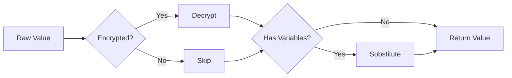

# Encryption & Variable Resolution - Quick Reference

## 🔐 Automatic Resolution Overview

The framework **automatically** handles:
- ✅ Decryption of `ENCRYPTED:` values
- ✅ Variable substitution `{{var}}` and `$var`
- ✅ Configuration value injection

**You never need to manually decrypt or resolve values!**

---

## 🎯 Variable Resolution Patterns

| Pattern | Source | Example | Description |
|---------|--------|---------|-------------|
| `{{variable}}` | Test context | `{{userId}}` | Variables saved in test |
| `$variable` | Test context | `$username` | Alt syntax for test vars |
| `{{config:KEY}}` | Config files | `{{config:API_TOKEN}}` | From .env files |
| `{{env:VAR}}` | Environment | `{{env:HOME}}` | OS environment vars |

## 📝 Feature File Examples

### Basic Authentication
```gherkin
# Password is automatically decrypted
Given user sets password to "ENCRYPTED:U2FsdGVkX1+abc123..."
```

### API Token from Config
```gherkin
# Token from .env file (API_TOKEN=my-token)
Given user sets bearer token "{{config:API_TOKEN}}"

# Or encrypted in .env (API_TOKEN=ENCRYPTED:U2FsdGVkX1+...)
Given user sets bearer token "{{config:API_TOKEN}}"  # Auto-decrypted!
```

### Environment Variables
```gherkin
# Use OS environment variables
Given user sets proxy to "{{env:HTTP_PROXY}}"
And user sets path to "{{env:PATH}}"
```

### Test Variables
```gherkin
# Save value to test context
Given user saves "john.doe" as "username"
# Use test variable
When user logs in as "{{username}}"
# Alternative syntax
When user logs in as "$username"
```

### No Naming Conflicts
```gherkin
# Test variable named API_TOKEN
Given user saves "test-token" as "API_TOKEN"

# Use test variable
When user uses "{{API_TOKEN}}"              # -> "test-token"

# Use config value explicitly
When user uses "{{config:API_TOKEN}}"       # -> from .env file
```

---

## 📊 Test Data Examples

### CSV File
```csv
username,password,apiKey
john,ENCRYPTED:U2FsdGVkX1+pass1...,ENCRYPTED:U2FsdGVkX1+key1...
jane,ENCRYPTED:U2FsdGVkX1+pass2...,ENCRYPTED:U2FsdGVkX1+key2...
```

### JSON File
```json
{
  "apiKey": "ENCRYPTED:U2FsdGVkX1+api123...",
  "dbPassword": "ENCRYPTED:U2FsdGVkX1+db456..."
}
```

### Excel File
| Username | Password | ApiKey |
|----------|----------|--------|
| admin | ENCRYPTED:U2FsdGVkX1+... | ENCRYPTED:U2FsdGVkX1+... |

### Loading Test Data
```typescript
// All encrypted values are automatically decrypted!
const data = await CSDataProvider.getInstance().loadData('test-data.csv');
// data[0].password is already decrypted
// data[0].apiKey is already decrypted
```

---

## ⚙️ Configuration Files

### .env File
```bash
# Automatically decrypted when accessed
DB_PASSWORD=ENCRYPTED:U2FsdGVkX1+dbpass123...
API_KEY=ENCRYPTED:U2FsdGVkX1+apikey456...
JWT_SECRET=ENCRYPTED:U2FsdGVkX1+jwt789...
```

### Accessing Config
```typescript
// Already decrypted!
const dbPassword = config.get('DB_PASSWORD');
```

---

## 🔨 Encrypting Values

### Using CLI
```bash
# Encrypt a value
npx cs-encrypt "myPassword"
# Output: ENCRYPTED:U2FsdGVkX1+...

# Encrypt with custom key
npx cs-encrypt "myPassword" --key "customKey"

# Encrypt file contents
npx cs-encrypt --file secrets.txt
```

### Programmatically
```typescript
const encrypted = CSEncryptionUtil.getInstance().encrypt('myPassword');
// Returns: ENCRYPTED:U2FsdGVkX1+...
```

---

## 🎯 Step Definition Examples

### BEFORE (Old Way - Manual Resolution)
```typescript
@CSBDDStepDef("user sets password {string}")
async setPassword(password: string): Promise<void> {
    // ❌ Manual decryption needed
    const decrypted = this.decrypt(password);
    const resolved = this.resolveVariable(decrypted);
    await this.page.fill('#password', resolved);
}
```

### AFTER (New Way - Automatic)
```typescript
@CSBDDStepDef("user sets password {string}")
async setPassword(password: string): Promise<void> {
    // ✅ Already decrypted and resolved!
    await this.page.fill('#password', password);
}
```

---

## 📋 Common Patterns

### Pattern 1: Encrypted Credentials
```gherkin
Scenario: Login with encrypted password
  Given user enters username "admin"
  And user enters password "ENCRYPTED:U2FsdGVkX1+..."
  When user clicks login
  Then user should be logged in
```

### Pattern 2: Variable Reuse
```gherkin
Background:
  Given user saves "ENCRYPTED:U2FsdGVkX1+token..." as "authToken"

Scenario: Multiple API calls
  Given user sets bearer token "{{authToken}}"
  When user calls API endpoint 1
  And user sets bearer token "{{authToken}}"
  When user calls API endpoint 2
```

### Pattern 3: Environment-Specific
```gherkin
Scenario: Use environment config
  Given user loads config for "{{ENV}}" environment
  # Config file has encrypted values that auto-decrypt
  When user connects with credentials from config
  Then connection should succeed
```

### Pattern 4: Data-Driven Testing
```gherkin
Scenario Outline: Test with encrypted data
  Given user loads test data from "users.csv"
  When user logs in as "<username>"
  # Password from CSV is auto-decrypted
  Then login should succeed

  Examples:
    | username |
    | user1    |
    | user2    |
```

---

## 🚀 Resolution Order



1. **Check Encryption**: If starts with `ENCRYPTED:`, decrypt it
2. **Variable Substitution**: Replace `{{var}}` or `$var` with values
3. **Return Resolved**: Final value ready to use

---

## ⚠️ Important Notes

### ✅ DO's
- Prefix sensitive values with `ENCRYPTED:`
- Use variables for reusable values
- Store shared secrets in config files
- Encrypt test data files with sensitive info

### ❌ DON'Ts
- Don't commit unencrypted passwords
- Don't manually decrypt in step definitions
- Don't hardcode encrypted values repeatedly
- Don't share encryption keys in code

---

## 🔍 Debugging

### Check if value is encrypted
```typescript
if (CSEncryptionUtil.getInstance().isEncrypted(value)) {
    console.log('Value is encrypted');
}
```

### Enable debug logging
```bash
export CS_ENCRYPTION_DEBUG=true
npm test
```

### Verify encryption key
```bash
echo $CS_ENCRYPTION_KEY
```

---

## 🎓 Examples by Use Case

### API Testing
```gherkin
Given user sets API key "ENCRYPTED:U2FsdGVkX1+..."
And user sets endpoint to "{{baseUrl}}/api/v1"
When user sends GET request
```

### Database Testing
```gherkin
Given user connects to database:
  | host     | localhost                     |
  | password | ENCRYPTED:U2FsdGVkX1+...     |
```

### UI Testing
```gherkin
Given user logs in with password "ENCRYPTED:U2FsdGVkX1+..."
When user navigates to secure page
```

### File Upload
```gherkin
Given user uploads file with token "ENCRYPTED:U2FsdGVkX1+..."
Then upload should succeed
```

---

## 📚 Related Documentation

- [Full Automatic Value Resolution Guide](./AUTOMATIC_VALUE_RESOLUTION_GUIDE.md)
- [API Testing Framework Documentation](./API_TESTING_FRAMEWORK_DOCUMENTATION.md)
- [Configuration Management Guide](./CONFIGURATION_GUIDE.md)

---

## 💡 Pro Tips

1. **Batch Encrypt**: Encrypt multiple values at once
   ```bash
   npx cs-encrypt-batch values.txt
   ```

2. **Environment Variables**: Use for CI/CD
   ```bash
   CS_ENCRYPTION_KEY=mykey npm test
   ```

3. **Cache Decrypted Values**: For performance
   ```gherkin
   Background:
     Given user caches encrypted config
   ```

4. **Validate Encryption**: In your tests
   ```gherkin
   Then all passwords should be encrypted
   ```

---

**Remember**: The framework handles everything automatically. Just use `ENCRYPTED:` prefix and variables - that's it! 🎉